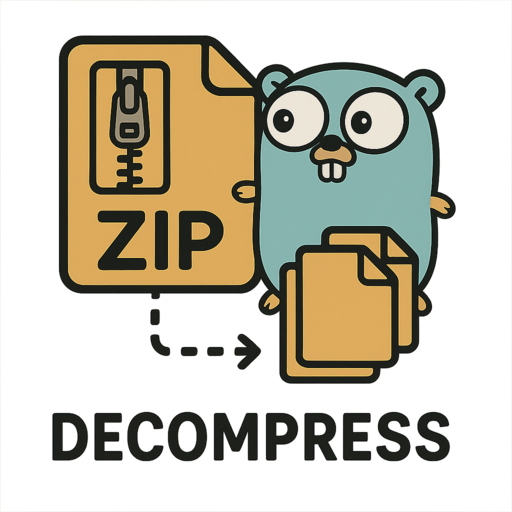

# FSDecomp



FSDecomp is a Go library that wraps any [`io.fs.FS`](https://pkg.go.dev/io/fs#FS) implementation and provides transparent decompression of compressed files.
When a file is requested, FSDecomp first tries to open it directly, and if not found, it attempts to locate and decompress a compressed version with a supported extension.

## Features

- Transparently access compressed files without specifying the compression extension
- Automatically decompress files on-the-fly
- Preserve proper file metadata (with compression extensions removed from names)
- Support for multiple compression formats:
  - gzip (.gz)
  - bzip2 (.bz2)
  - zstandard (.zst)
  - LZ4 (.lz4)

## Installation

```bash
go get github.com/AndreRenaud/fsdecomp
```

## Usage

### Basic Usage

```go
package main

import (
	"fmt"
	"io"
	"io/fs"
	"log"
	"os"

	"github.com/AndreRenaud/fsdecomp"
)

func main() {
	// Create a decompressing filesystem wrapper around os.DirFS
	fsys := fsdecomp.New(os.DirFS("./data"))

	// Open a file - if data/config.json doesn't exist but data/config.json.gz does,
	// it will be transparently decompressed
	file, err := fsys.Open("config.json")
	if err != nil {
		log.Fatal(err)
	}
	defer file.Close()

	// Read and use the file as if it were a normal uncompressed file
	content, err := io.ReadAll(file)
	if err != nil {
		log.Fatal(err)
	}

	fmt.Println(string(content))
}
```

### With fs.Sub

```go
// Create a subfolder view with decompression support
baseFS := os.DirFS(".")
decompFS := fsdecomp.New(baseFS)
configFS, err := fs.Sub(decompFS, "configs")
if err != nil {
    log.Fatal(err)
}

// This will find and decompress configs/app.yaml.gz if configs/app.yaml doesn't exist
file, err := configFS.Open("app.yaml")
```

## Limitations

- Write operations are not supported (follows the read-only `fs.FS` interface)
- The library prioritizes the uncompressed version if both compressed and uncompressed versions exist
- Directory operations follow the behavior of the underlying filesystem

## License

Zero-Clause BSD - See LICENSE file for details.

## Contributing

Contributions are welcome! Feel free to submit issues or pull requests.